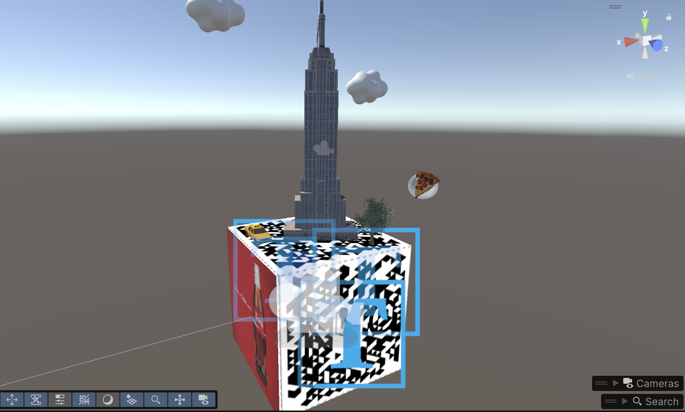
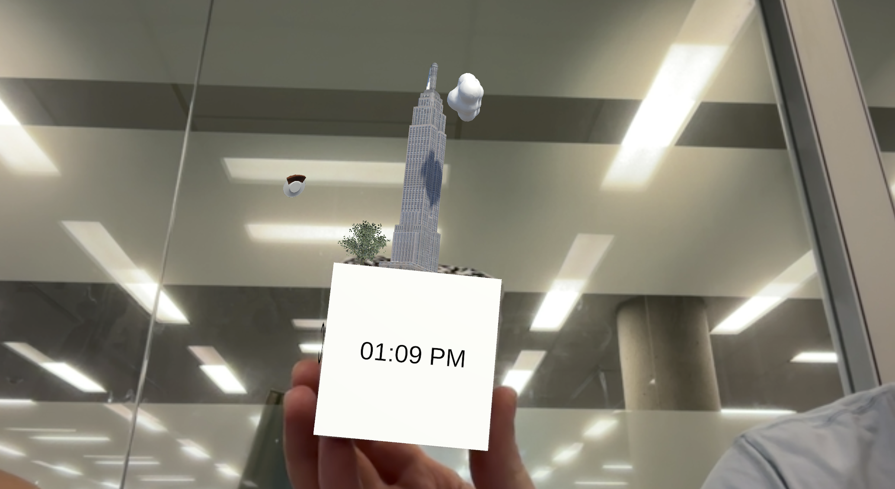
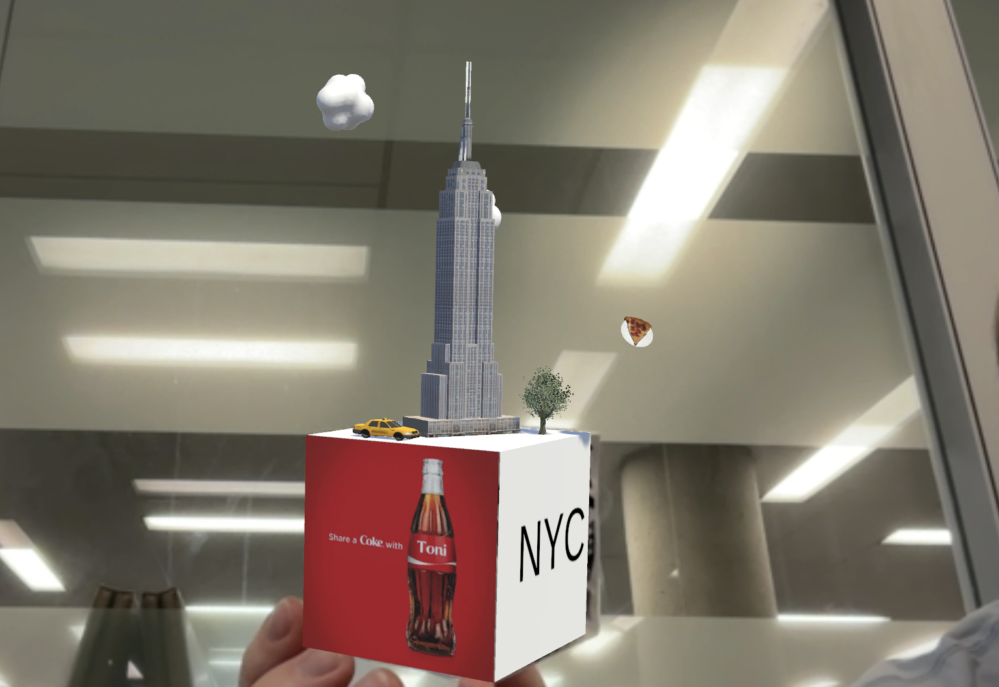
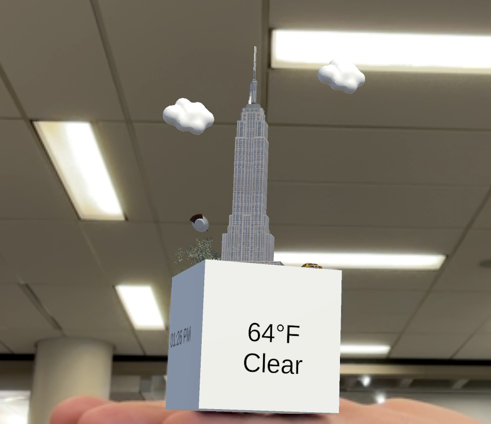

# NYC Knickknack AR/VR Project

## Project Overview & Motivation

This project is an AR/VR “New York City knickknack” built in Unity that combines stylized 3D objects (the Empire State Building, a yellow taxi, a slice of pizza, clouds, and a tree) with live data for time, weather, and location. The knickknack appears anchored in AR and behaves like a small interactive souvenir that reflects what is happening in New York in real time.

I chose New York City simply because I like NYC. It is visually iconic, full of recognizable symbols, and its constantly changing weather makes the live data feel meaningful and fun. The goal was to capture that vibe in a compact, playful digital object that a user can explore by moving around it.

---

## Design: Knickknacks, Models, and Visual Elements

The knickknack is built around a small scene that sits on or around a cube in AR. On and around this cube I placed several 3D elements that represent New York:

- **Empire State Building** – a simplified building model that stands in for the NYC skyline.  
- **Yellow taxi** – a small car model that represents the city’s classic taxis and streets.  
- **Pizza slice** – a stylized slice as a nod to NYC food culture.  
- **Clouds** – simple cloud meshes floating above the scene.  
- **Tree** – a small tree model to add greenery and tie into the idea of “weather” and environment.

Some of these models were created or edited in Blender, then imported into Unity, where I adjusted scale, materials, and placement so they read clearly in AR and work together as a cohesive composition. Each side of the cube emphasizes a different piece of information:

- One face shows **weather data** (temperature and main conditions) using TextMeshPro.
- Another face shows the **current time**.
- Another face shows the **location text** (e.g., “New York, USA”).

The visual design tries to balance a playful “souvenir” feel with clean, readable text and simple materials so that the scene doesn’t feel cluttered.

## Screenshots

### AR Experience Views

---

## Process: Implementation and Code Structure

The application is built in Unity with AR support (using Vuforia framework) and C# scripts.

### Core Components

- **Unity Scene**
  - AR camera and tracking (image target / MultiTarget).
  - Cube or base object that holds the NYC knickknack.
  - Child objects for the Empire State Building, taxi, pizza, clouds, and tree.
  - Separate TextMeshPro objects for:
    - Weather (temperature + conditions).
    - Time.
    - Location text.

- **Scripts**
  - `WeatherAPI.cs`  
    - Calls the OpenWeather **Current Weather Data** endpoint for New York.
    - Parses the JSON response to extract temperature (in Fahrenheit) and a simple condition string.
    - Updates the weather TextMeshPro on one face of the cube.
  - `TimeDisplay.cs`  
    - Reads the system time at a regular interval.
    - Formats it and updates the time TextMeshPro on another face.

### Data and Libraries

- **Unity** (scene, GameObjects, prefabs, materials).
- **AR framework** (Vuforia) for tracking and placing the knickknack in physical space.
- **TextMeshPro** for high‑quality, readable 3D text in the scene.
- **OpenWeather API** for current weather data (temperature and conditions) for New York.

